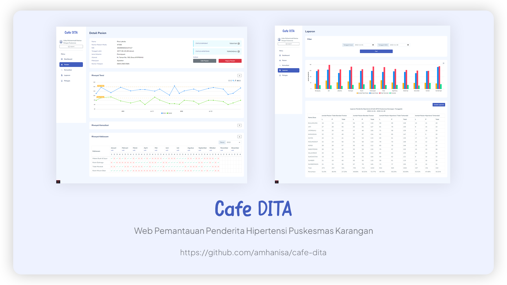

<div style="text-align:center">

# Cafe DITA



Web Cafe DITA merupakan sistem pemantauan layanan kesehatan bagi penderita hipertensi di Puskesmas Karangan, Trenggalek, Jawa Timur.

</div>

## Requirement

Setidaknya versi saat development ini

-   PHP 8.0
-   Composer 2.4.1
-   Node 18.8.0
-   NPM 8.18

## Cara Instalasi

Install dependency PHP dengan Composer

```
composer install
```

Install dependency JS dengan NPM

```
npm install
```

Copy .env dan sesuaikan config databasenya

```
copy .env.example .env
```

Generate Key

```
php artisan key:generate
```

Migrate dan Seed data default

```
php artisan migrate:fresh --seed
```

(Optional) Seed fake data

```
php artisan db:seed --class FakeDataSeeder
```

## Cara Run Project

Jalankan server

```
php artisan serve
```

Jalankan vite

```
npm run dev
```

## Default Account

**username** : amhanisa

**password** : amhanisa
